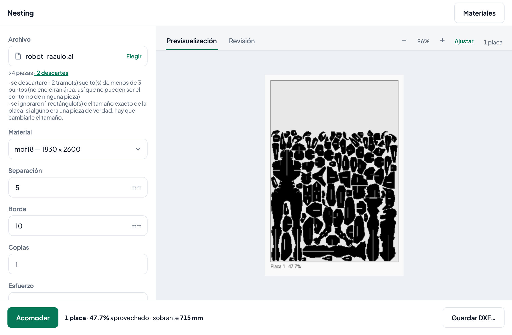
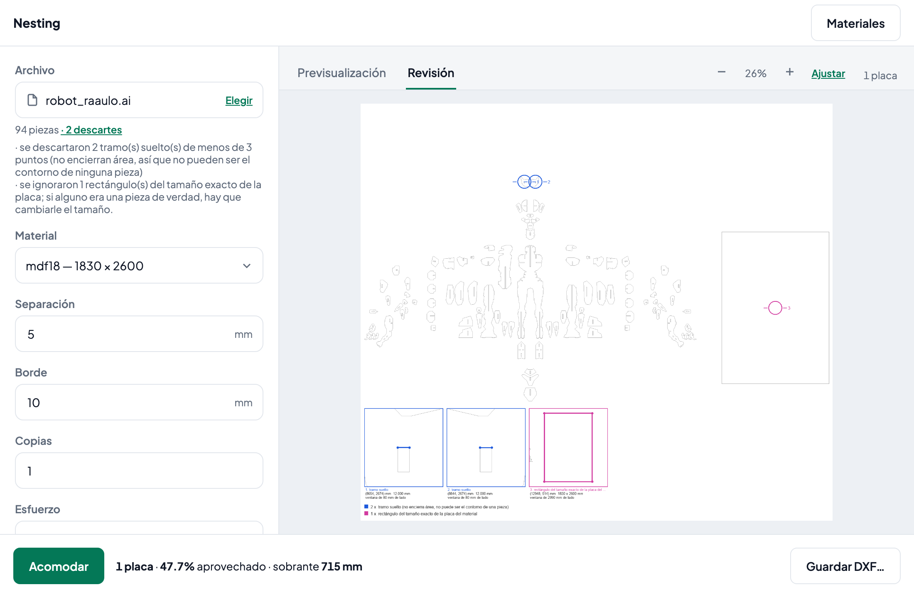

# Nesting

*[Español](README.es.md)*

**Fits parts onto sheets using as little material as possible, so that what is
left over stays free and in one piece.**

You give it a vector file with the parts to cut, you pick the sheet you are
going to cut them from, and it hands you back a DXF ready for the router.

It is not only about spending less. The engine goes for the fewest sheets
first; then, on the last one, for **as little material as possible**, because
that is what brings you closer to not needing that sheet at all; and only then,
with the same amount of material up there, for that sheet to be **as compact as
possible**, so the strip that is left stays whole for the next job.

[](LICENSE)
[](https://www.python.org/)
[](tests/)

---

## What it does

Open the file, pick the material and hit **Acomodar**.

| | |
|---|---|
| **In** | `.dxf`, `.ai` or `.3dm` with the outlines of the parts |
| **Out** | a `.dxf` with everything laid out, plus a PNG preview |
| **Decides** | how many sheets, where each part goes and at what rotation |
| **Respects** | the spacing between parts, the margin against the edge and the grain of the material |
| **Aims for** | the fewest sheets; then the least possible material left on the last one; then, at equal material, that sheet as compact as possible |

It also shows you **what it discarded and why**, marked on your own drawing:
the loose segments, the curves that do not lie on the plane, the outlines that
do not close. That appears a second after you open the file, before you commit
to a layout that can take several minutes.

---

## Getting started

### The desktop application

```bash
git clone git@github.com:rauleoyarzun/nesting-cut.git && cd nesting-cut
python3.13 -m venv .venv
.venv/bin/pip install -e .
.venv/bin/nest-app
```

It opens a window. There is no server to start and no URL to type by hand: the
program starts one on `127.0.0.1` on a random port and shuts it down when you
close the window.

### The command line

```bash
.venv/bin/nest piezas.ai --material mdf18 -o cortado.dxf
```

Does exactly the same thing without opening a window. Useful for automating it
or for running it on a headless server.

---

## The screen



A real layout: the 12 parts of a bench —round seats and concave legs—, three
copies of each, on a 1830 × 2600 MDF sheet. They all fit on **a single sheet**,
taking up 40.7% of the surface, and —this is the part that matters— the **694 mm**
strip you see free at the top stays whole for the next job.

The file in the screenshot is generated by `bench/make_sample.py`, so you can
reproduce it.

The result tells you four things: **how many sheets** were needed, **what
percentage** of that surface ended up covered by parts, the **leftover** —the
millimetres of free strip on the last sheet, measured from where the tallest
part ends to the edge— and the **material on the last sheet**, in m².

The last two are shown together on purpose, because they compete. The engine
picks the layout with the least material on the last sheet, and that sometimes
shortens the free strip in exchange. Seeing both is what lets you judge whether
the trade was worth it for this job: the strip tells you what offcut you are
walking away with, the m² tell you how close you were to not needing that sheet
at all.

While it runs, the bar at the bottom says where it is (`Intento 2 de 3 ·
ubicadas 47 de 93 · placa 1` — attempt 2 of 3, 47 of 93 placed, sheet 1) and you
can **cancel** at any moment. Cancelling does not leave a half-finished result:
the DXF never gets written.

### Review: what was discarded and why



The discards marked **on your own drawing**, with a coloured circle at the exact
spot, a magnifier for each one and the reason written beside it. Here they are
two loose segments, 10 and 12 mm, that enclose no area, so they cannot be the
outline of any part; the magnifier shows where they are and at what scale.
Below, how many there were of each kind.

This appears **a second after you open the file**, without laying out anything.
That is when it is useful: you are still in time to go back to the original and
fix it.

Both images can be enlarged: mouse wheel to zoom in where the cursor is, drag to
pan, double click to toggle between 100% and fit.

---

## Materials

The catalogue is edited from the **Materiales** screen: name, width, height and
whether the grain has to be respected.

It ships with four:

| Material | Sheet (mm) | Grain |
|---|---|---|
| `mdf18` | 1830 × 2600 | Does not matter |
| `mdf15` | 1830 × 2600 | Does not matter |
| `multilam18` | 1220 × 2440 | Respect |
| `fenolico18` | 1220 × 2440 | Respect |

Yours are saved in your user folder, **not inside the program**, so they survive
an update:

| | |
|---|---|
| macOS | `~/Library/Application Support/nesting/materials.yaml` |
| Windows | `%APPDATA%\nesting\materials.yaml` |
| Linux | `~/.local/share/nesting/materials.yaml` |

From the materials screen you can go back to the original catalogue whenever you
want.

---

## Options

What the screen shows as controls, the CLI takes as flags. They are the same
parameters.

| Control | Flag | What it is |
|---|---|---|
| Material | `--material` | Key from the catalogue. Required. |
| Veta | `--veta` | `respetar` (only 0° and 180°) or `libre`. Starts from the material's and can be changed for this run without touching the catalogue. With the grain respected, Posiciones is locked at 0° and 180°. |
| Recortes | — | Loose offcuts you already have and want to use before opening a new sheet. Loaded with a size and a quantity, filled largest to smallest, and only last while the program stays open: they never go into the catalogue. **Interface only; the CLI does not accept them.** |
| Separación | `--sep` | Minimum millimetres between two parts. |
| Borde | `--borde` | Margin against the edge of the sheet. |
| Copias | `--copias` | How many times to repeat the entire contents of the file. |
| Esfuerzo | `--esfuerzo` | `rapido` (one pass), `normal` (that pass plus one batch of at least 12 variants -- as many as cores when there are more than 12 -- trying the large repeated parts nested in pairs with different kinds of interlock, and when there are none, other insertion orders) or `lento` (three batches: more pair types and perturbed orientations). |
| Núcleos | `--nucleos` | How many cores to use to try the variants of each batch in parallel. Starts at all but two, capped by memory (each process uses about 2300 MB). Each batch tries at least 12 variants: with fewer than 12 cores the same 12 just run in more rounds and only the time changes; with 12 or more it can try extra variants, and then the result can change too. |
| Posiciones | — | How many positions each part can rotate to, spread evenly across the full turn: 4, 8 or 16. `Personalizado` reveals the Ángulos field to type the list by hand. **Interface only.** With the grain respected it is locked at 0° and 180°. |
| Ángulos | `--angulos` | Candidate rotations, comma separated. On screen it now lives behind `Posiciones → Personalizado`. |
| Permitir espejadas | `--sin-espejo` | Whether a part may be flipped over like a glove. The screen has it on; the flag turns it off. |
| Tolerancia de cierre | `--tol-cierre` | How far apart an outline may be and still count as closed. |
| Resolución | `--resolucion` | Millimetres per pixel of the raster. Going from 2 down to 1 quadruples the work. Starts at 1. |
| — | `--unidades` | Units of the file, if the file does not declare them. |
| — | `--preview` | Path for the preview PNG. |
| — | `--diagnostico` | Path for the PNG that marks the discards. If it is the only thing you ask for, it lays out nothing and finishes in a second. |

**More effort does not always give a better result, but it never gives a worse
one**: with the same number of cores, what Normal tries is the beginning of
what Lento tries, and it keeps the best of all of them.

When the result uses as many sheets as the minimum the parts' area allows, it
says so: **No se puede con menos placas** ("it cannot be done with fewer
sheets"). If it does not say it, that does not mean it can: area is a bound,
not a promise. It is not reported when offcuts are loaded.

---

## What it will never do

**It does not write a DXF it has not verified.** Before touching the disk it
checks that no part overlaps another, that none sticks out of the sheet, and
that the spacing and the margin you asked for are respected. If any of that
fails, **nothing is written** and it tells you what happened.

That rule does not bend. The file that comes out of here goes to a machine that
cuts real wood.

---

## Formats

| | |
|---|---|
| `.dxf` | What almost any CAD exports. |
| `.ai` | Only **AI3 / PostScript** ones, which are plain text and start with `%!PS-Adobe`. That is what Rhino and CorelDRAW export. If you open it in a text editor and it does not start like that, it is no good: convert it to DXF. |
| `.3dm` | Rhino. The curves that lie on the XY plane are read; the rest is discarded and you are told which. |
| `.cdr` | **No.** It is Corel's closed binary format and there is no reliable free parser. Export it from CorelDRAW to DXF or to AI3. |

---

## Development

```bash
.venv/bin/pip install -e ".[dev]"    # pytest, httpx and pyinstaller
.venv/bin/pytest                     # the whole suite (1028, ~7 min)
.venv/bin/pytest tests/app           # the interface only (~10 s)
```

### Building the executable

```bash
./packaging/construir.sh          # macOS
```

It leaves `dist/Nesting/` (~106 MB) and a `.zip` (~56 MB). It goes in folder
mode and not single-file on purpose: single-file mode unpacks itself on every
start, and with scipy and rhino3dm inside that is several seconds of waiting
every time somebody opens the program.

The script **verifies the package before compressing it** (`--autotest`). That
is not optional: a package missing a resource or a hidden module looks perfect
on the machine where it was built and fails on the machine that receives it.

**Windows** goes through `packaging/construir.ps1`, which does the same thing
but waits for the autotest differently (see the comment in the script).
PyInstaller does not cross-compile: the `.exe` can only be built on Windows. The
[`.github/workflows/windows.yml`](.github/workflows/windows.yml) workflow builds
it on a GitHub runner, runs the suite there and leaves the `.zip` to download.

### Measuring whether a change was an improvement

```bash
.venv/bin/python bench/run_bench.py
```

Sheets, utilisation percentage and seconds over real files. See
[`bench/README.md`](bench/README.md).

### Regenerating the icon

```bash
.venv/bin/python herramientas/icono.py
```

It is drawn with code, not just stored as a binary. It leaves the `.ico`, the
`.icns` and the favicon. See [`herramientas/README.md`](herramientas/README.md).

### Diagnosing the window

```bash
.venv/bin/python herramientas/ventana_real.py
```

There are defects in this interface that you cannot see by reading the code or
by running the page in a browser: they live in the main thread of the windowing
system. This tool drives the real window from the outside and catches them. See
[`herramientas/README.md`](herramientas/README.md).

---

## How it is put together

```
src/nesting/       the engine: read, lay out, verify, write
src/nesting_app/   the interface: local server, window, screens
```

**On import, `nesting` does not touch `nesting_app`.** The arrow points one way
only, and that is what lets the engine be used from the CLI, from the window or
from a web server without changing a line of it. There is a single exception,
lazy and documented where it lives (`nesting/model/material.py`): to find the
catalogue that ships with the program you need to know whether we are running
from the repo or from a packaged executable, and the interface is what knows
that. If the interface package is not there —a bare engine install— it falls
back to the usual lookup and keeps working.

Inside the interface there is another separation, just as deliberate:
`nesting_app/archivos.py` is **the only file that knows whether we are on the
desktop or on the web**. On the desktop the native dialog returns a path on
disk; on the web the uploaded contents arrive. Both paths end up in the same
place, and from there on nobody asks again where the file came from.

The design decisions, with their reasons, are in
[`docs/superpowers/specs/`](docs/superpowers/specs/).

---

## License

[MIT](LICENSE) © Raul Oyarzun
